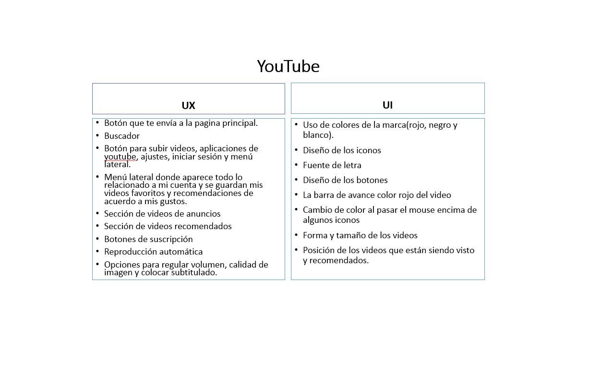
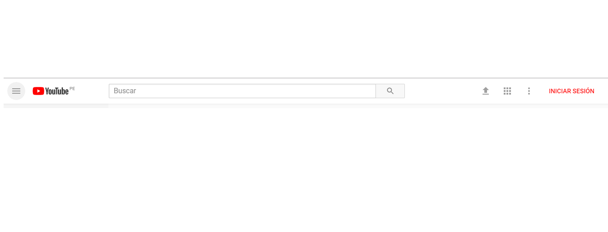
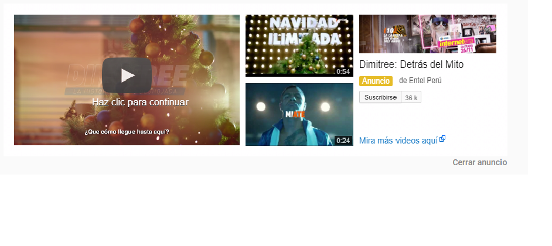

# Introduccion a UX Designer

## Youtube, ¿qué partes conforman el UX y qué partes el UI?

Acontinuacion se muestra un cuadro que contienen las partes que conforman el UX y el UI de la pagina web de youtube.

## Buscador y botones 

## Anuncios

## controles de volumen, barra de avance color rojo y ajustes de panatalla

## menu lateral

